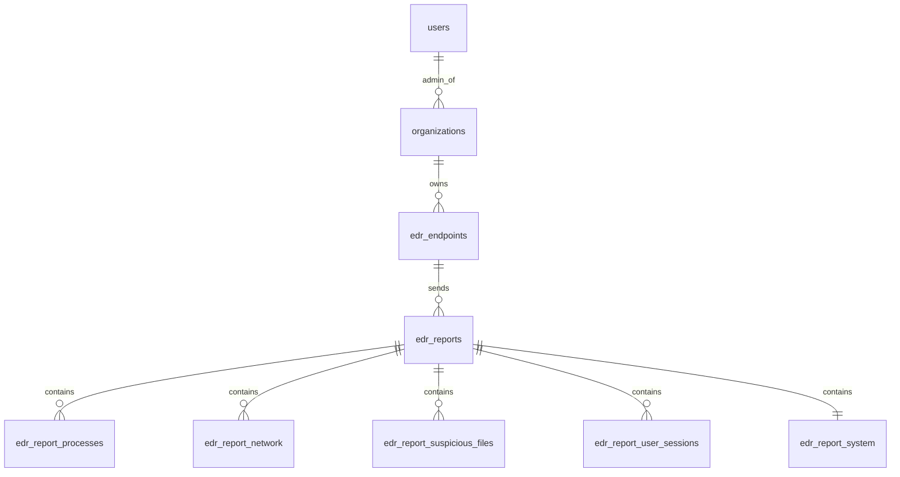

# Schema EDR (MySQL) - Version simplifiee

Ce schema correspond a `client/database.sql` et stocke uniquement les donnees demandees par l'EDR :
- Processus (PID, nom, CPU%, RAM%, chemin executable)
- Reseau (connexions actives, ports ouverts, adresses distantes)
- Fichiers suspects (nouveaux fichiers dans repertoires sensibles)
- Utilisateurs (sessions actives, utilisateurs connectes)
- Systeme (OS, version kernel, uptime, hostname)

## Relations principales

## Regle admin unique

- 1 seul admin par organisation via `organizations.admin_user_id`.

## Flux recommande

1. L'agent EDR envoie un rapport pour un endpoint.
2. La machine est creee/maj dans `edr_endpoints`.
3. Le rapport est insere dans `edr_reports`.
4. Les categories de donnees sont enregistrees dans :
   - `edr_report_processes`
   - `edr_report_network`
   - `edr_report_suspicious_files`
   - `edr_report_user_sessions`
   - `edr_report_system`

## Fichier SQL a importer

- `client/database.sql`
